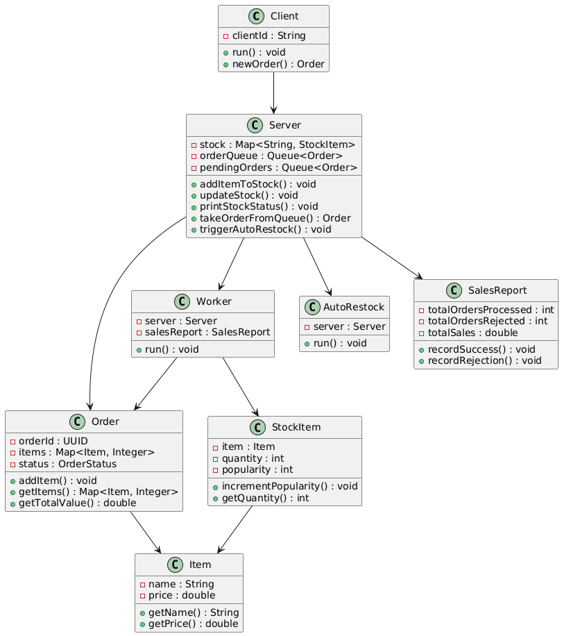

# E-commerce Concorrente com Controle de Estoque

Este projeto simula um sistema de processamento de pedidos para uma loja de e-commerce, com foco em **concorrência** e **controle de acesso seguro a dados compartilhados**. O sistema utiliza múltiplos clientes e trabalhadores (threads) para processar pedidos e gerenciar um estoque compartilhado de forma eficiente e segura.

## Objetivo

- Gerenciar múltiplos pedidos simultâneos feitos por diferentes clientes.
- Controlar o acesso ao estoque compartilhado de produtos.
- Processar pedidos de forma concorrente e evitar inconsistências nos dados.
- Gerar relatórios periódicos sobre o estado do sistema.
- Reabastecer automaticamente o estoque de produtos populares.

## Funcionalidades

1. **Fila de Pedidos**: 
   - Todos os pedidos feitos pelos clientes são colocados em uma fila concorrente. Os trabalhadores retiram os pedidos para processá-los.
   
2. **Processamento de Pedidos**: 
   - Cada pedido contém uma lista de produtos e quantidades. Se os itens estiverem disponíveis no estoque, o pedido é processado e o estoque atualizado. Caso contrário, o pedido é colocado em uma fila de espera até o reabastecimento.

3. **Reabastecimento Automático**: 
   - O sistema reabastece automaticamente os produtos do estoque com base na popularidade dos itens e nas quantidades mínimas estabelecidas.

4. **Relatórios de Vendas**: 
   - Um relatório é gerado a cada 30 segundos, mostrando o número total de pedidos processados, rejeitados, pendentes e o valor total das vendas.

5. **Clientes Simulados**:
   - Clientes são threads que geram pedidos aleatórios e os colocam na fila de pedidos.

## Estrutura do Projeto

```
ecommerce-conc/
├── src/
│   ├── ecommerce/
│   │   ├── model/
│   │   │   ├── Client.java
│   │   │   ├── Item.java
│   │   │   ├── Order.java
│   │   │   ├── OrderStatus.java
│   │   │   ├── StockItem.java
│   │   ├── service/
│   │   │   ├── AutoRestock.java
│   │   │   ├── SalesReport.java
│   │   │   ├── Server.java
│   │   │   ├── Worker.java
│   │   ├── Main.java
├── README.md
└── Makefile
```

### Principais Classes

- **Main.java**: Ponto de entrada da aplicação, onde todos os componentes (servidor, clientes, trabalhadores) são configurados.
- **Client.java**: Simula um cliente gerando pedidos aleatórios.
- **Order.java**: Representa um pedido com itens e quantidades.
- **Item.java**: Representa um item no sistema, com nome e preço.
- **StockItem.java**: Controla a quantidade de um item no estoque e sua popularidade.
- **Server.java**: Gerencia o estoque e a fila de pedidos.
- **Worker.java**: Processa os pedidos e atualiza o estoque.
- **SalesReport.java**: Gera relatórios periódicos sobre as vendas e os pedidos.
- **AutoRestock.java**: Reabastece automaticamente o estoque de produtos conforme a demanda.

## Arquitetura do Projeto 


## Como Executar

### Requisitos

- Java 8 ou superior
- Make

### Passos

1. **Clonar o repositório:**

   ```bash
   git clone <URL do repositório>
   cd ecommerce-conc
   ```

2. **Compilar o projeto:**

   Utilize o comando `make build` para compilar o projeto:

   ```bash
   make build
   ```

3. **Executar o projeto:**

   Para rodar o projeto, execute:

   ```bash
   make run
   ```

4. **Limpar o projeto:**

   Para remover os arquivos `.class`:

   ```bash
   make clean
   ```

### Funcionamento

- O sistema simula um ambiente onde clientes criam pedidos e os trabalhadores processam esses pedidos de forma concorrente.
- O estoque é gerenciado automaticamente, e os itens são reabastecidos de acordo com a popularidade.
- O sistema imprime relatórios periódicos e exibe o status do estoque antes e depois de cada reabastecimento.